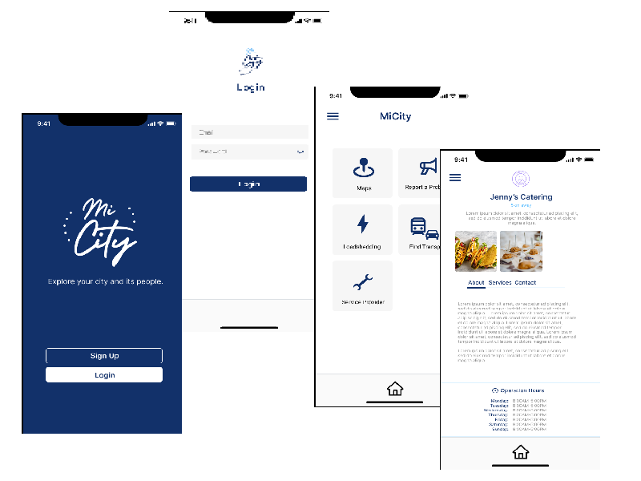

# micity-ios-react-native

> Explore your city and its people.



Explore your city and its people.

## Built With

- TypeScript
- React Native
- Expo

## Getting Started

**This is an example of how you may give instructions on setting up your project locally.**

To get a local copy up and running follow these simple example steps.

## Prerequisites

- Nodejs
- npm or yarn

## Setup

Navigate to your desired location to download the contents of this repository.
In order to clone this repository just type the following commands over the terminal in Linux or Mac or the Windows cmd console.

```s
git clone https://github.com/guillainbisimwa/micity-ios-react-native.git

```

## Install

Run the following commands to install dependencies:


```s
cd micity-ios-react-native/
yarn install

```

1. Usage

In order to run the mobile app locally, just type this command:

```s
yarn start

```

2. Run tests

In order to test this project locally, just type this command:

```s
npm test

```

3. Deployment

- Building APKs for Android emulators and devices

The default file format used when building Android apps with `EAS Build` is an Android App Bundle (`AAB` / `.aab`). This format is optimized for distributing to the Google Play Store, but `AABs` can't be installed directly to your device. To install a build directly to your Android device or emulator, you need to build an Android Package (`APK` / `.apk`) instead.

Now, to run your build run (apk)

```s
    eas build -p android --profile simulator
```

To upload your Android app to the Google Play Store, run `eas submit --platform android` and follow the instructions on the screen.

- Building for iOS simulators

Running a build of your app in an iOS simulator is particularly useful in managed apps to get the standalone (independent of Expo Go) version of the app running easily without needing to deploy to `TestFlight` or even have an `Apple Developer account`.

Now, to run your build run

```s
    eas build -p ios --profile simulator
```

If you haven't installed or run the iOS simulator before, follow the [iOS simulator guide](https://docs.expo.dev/workflow/ios-simulator/) before proceeding.

Run `eas build --platform android` to build for Android.
Run `eas build --platform ios` to build for iOS.
Alternatively, you can run `eas build --platform all` to build for Android and iOS at the same time.

To submit the binary to the App Store, run `eas submit -p ios` from inside your project directory. The command will lead you step by step through the process of submitting the app.

4. Publishing/Deploying an Expo app in Production

When you publish an Expo app, they compile it into a JavaScript bundle with production flags enabled. That is, they minify the source and we tell Metro to build in production mode (which in turn sets __DEV__ to false amongst other things). After compilation, the upload that bundle, along with any assets that it requires (see Assets) to CloudFront.

Run `expo publish` to update your app.

## Author

👤 **Guillain Bisimwa**

- Github : [@guillainbisimwa](https://github.com/guillainbisimwa)
- Twitter : [@gullain_bisimwa](https://twitter.com/gullain_bisimwa)
- Linkedin : [guillain-bisimwa](https://www.linkedin.com/in/guillain-bisimwa-8a8b7a7b/)

## 🤝 Contributing

Contributions, issues, and feature requests are welcome!

Feel free to check the [issues page](https://github.com/guillainbisimwa/MiCity/issues/).

## Show your support

Give a ⭐️ if you like this project!

## Acknowledgments

- Zaio

## 📝 License

This project is [MIT](./MIT.md) licensed.
